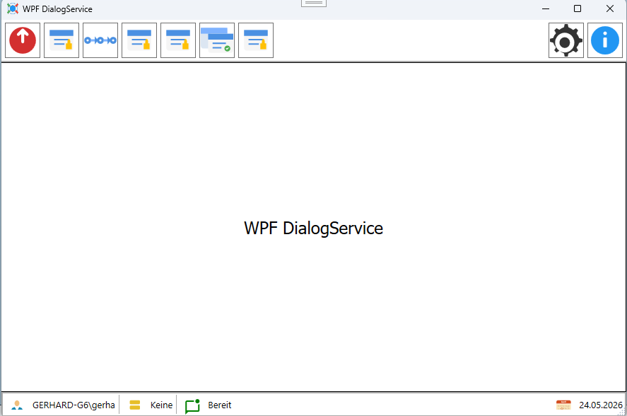
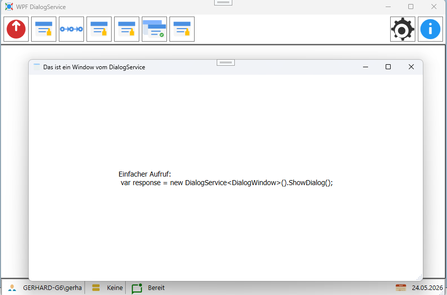
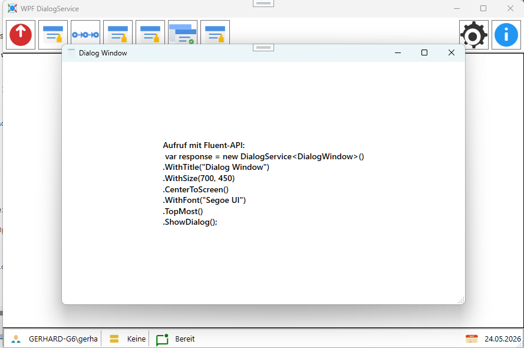

# WPF DialogService


# Projekt
Das Beispiel zum **WPFDialogService** .zeigt den Einsatz der Klasse `DialogService` in einem WPF Projekt. Es ist eine einfache Anwendung, die die Funktionalität des DialogService demonstriert.
<br/>

<br/>
Bei dem `DialogService` handelt es sich um eine Klasse, die den Aufruf von Dialogen in einer WPF-Anwendung vereinfacht.

# Features
- Einfache API zum Anzeigen von Dialogen mit .Show() und .ShowDialg().
- Übergabe von Parametern, die an den Konstruktor des Dialog weitergegeben werden.
- Einheitliche Rückgabe des DialogResults, um die Benutzeraktion zu erfassen.
- Fluent-API für eine intuitive und lesbare Syntax.

# Möglichkeiten
## DialogResponse<T> Klasse

In der `DialogResponse<TWindow>` Klasse werden die Informationen über den Dialog zurückgegeben, einschließlich des Dialogergebnisses und der Instanz des Dialogs.
````csharp
public class DialogResponse<TWindow> where TWindow : Window
{
    public TWindow Window { get; }

    public bool? DialogResult { get; }
        
    public bool IsModal { get; }

    public DialogResponse(TWindow window, bool? dialogResult, bool isModal)
    {
        Window = window;
        DialogResult = dialogResult;
        IsModal = isModal;  
    }
}
````
Bei Bedarf können Sie die `DialogResponse<TWindow>` Klasse erweitern, um zusätzliche Informationen zurückzugeben, wie z.B. Benutzereingaben oder andere relevante Daten.

## Einfacher Aufruf
Mit einer einzelnen Zeile können Sie einen Dialog aufrufen. Dabei können Sie Parameter übergeben, die an den Konstruktor des Dialogs weitergegeben werden.
<br/>

<br/>

````csharp
var response = new DialogService<DialogWindow>(parm).WithOwner(this).ShowDialog();
if (response.DialogResult == true)
{
    // OK
}
else
{
    // Abbrechen
}
````

## Aufruf mit Fluent-API
Für einen noch flexibleren und lesbareren Aufruf können Sie die Fluent-API verwenden, um zusätzliche Optionen wie Titel, Größe, Positionierung und Schriftart festzulegen.
<br/>

<br/>

````csharp
var response = new DialogService<DialogWindow>(parm)
    .WithTitle("Dialog Window")
    .WithSize(700, 450)
    .CenterToScreen()
    .WithFont("Segoe UI")
    .TopMost()
    .ShowDialog();
if (response.DialogResult == true)
{
    // OK
}
else
{
    // Abbrechen
}
````


- Migration auf NET 10
- Weiterentwicklung mit neuen Features
- Neues Design und Demoprogramm
